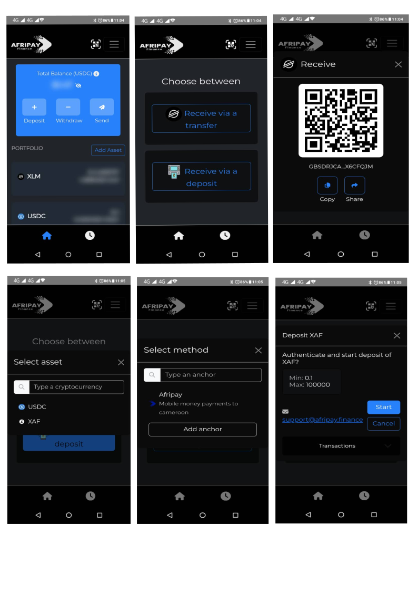

# AfripayFinance
Afripay Finance APIs for cross-border payments using Stellar's blockchain and Anchor-in-a-Box integration. Supports SEP-6, SEP-10, SEP-12, and SEP-24 protocols for deposits, withdrawals, and KYC.

# Afripay Finance – Stellar Anchor-in-a-Box API Integration

## **Overview**  
**Afripay Finance** provides cross-border payment solutions for underserved regions, starting with Cameroon. Our APIs leverage Stellar's blockchain infrastructure and the Anchor-in-a-Box framework to facilitate secure and fast international payments. And to do this, Afripay Finance relies on two platforms, one of which is a wallet that allows users unfamiliar with the world of cryptocurrencies to carry out their transactions securely, and another for users already invested in cryptocurrencies. However, it is important to note that the heart of all transactions (deposit, withdrawal, sending and currency exchange) remains the Stellar network for both platforms.

## **Front-end of Afripay Finance the Crypto-wallet**

This project showcases the APIs developed to enable:
- **Deposits** and **withdrawals** using SEP-24.
- **Authentication** with SEP-10.
- **KYC and Compliance** with SEP-12.
- **Asset listing** and **transactions** with SEP-6.

The platform targets remittances, business payments, and financial inclusion through fast, blockchain-backed services.

---

## **Features**
- **Stellar Anchor Integration:** Fully integrated with Stellar’s anchor-in-a-box to handle on/off-ramp transactions.
- **API-First Architecture:** Modular APIs for easy integration by partners and businesses.
- **Mobile Money Integration:** Direct interaction with mobile wallets for deposits and withdrawals.
- **Partnerships Secured:** We have collaborated with key financial partners to ensure smooth service.

---

## **Technical Architecture**

---

## **SCF Build Submission Goals**  
1. **Expand Payment Services** to neighboring countries in West and Central Africa.  
2. **Enhance the User Experience** with faster deposits and withdrawals.  
3. **Attract Business Partners** to use Afripay Finance for remittances and B2B payments.  

---

## **How to Contribute**
We welcome contributions! Please open an issue or submit a pull request if you find a bug or have a feature request.

---

## **License**
This project is licensed under the MIT License – see the [LICENSE](LICENSE) file for details.

---

## **Contact**
For more details or inquiries, email us at:  
📧 main.admin@afripay.finance

